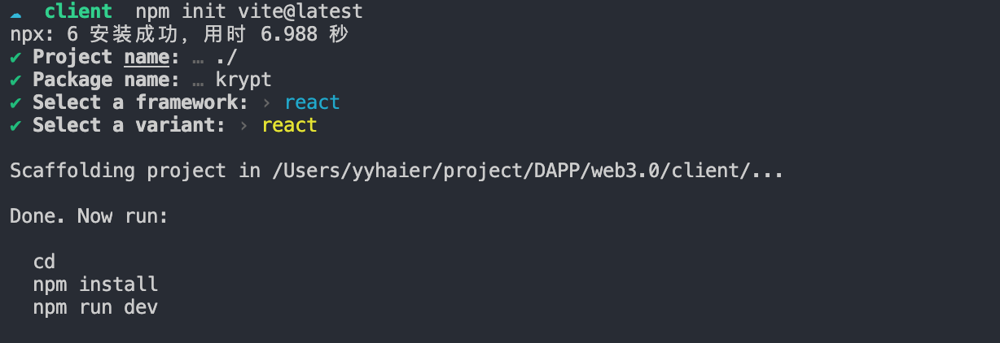

<!--
 * @Author: YYHaier
 * @Github: https://github.com/yuhai-yang
 * @Date: 2022-01-13 14:15:36
 * @LastEditors: yyhaier
 * @LastEditTime: 2022-01-13 15:16:45
 * @FilePath: /web3.0/README.md
-->
# WEB3 Demo

## 1. create our project 
```
mkdir web3.0 && cd web3.0
```

创建一个文件夹，用来构建前端页面  

```
mkdir client

# 这里使用Vite框架创建前端模板，当然前提是你的电脑已经安装了nodejs  
# (my version : "v14.17.3"，npm version : "6.14.13")

npm init vite@latest
```
根据提示，完成初始化  

    

初始化完成后，可以安装各种依赖了🎉  

```
npm install && npm run dev
```
测试一下项目是否运行起来，打开本地连接 http://localhost:3000 ，可以看到react初始画面。

## 2. import css for the project


安装所有需要的tailwindcss依赖

```
npm install -D tailwindcss
```
初始化项目
```
npx tailwindcss init
```
此时会新增一个文件: __tailwind.config.js__    
将里面内容替换
```
module.exports = {
  content: ["./src/**/*.{html,js}"],
  theme: {
    extend: {},
  },
  plugins: [],
}
```
之后将CSS替换成tailwindcss,路径：“client/index.css”
```
@tailwind base;
@tailwind components;
@tailwind utilities;
``` 
修改App.jsx

## 3. Start to creat react application


首先在client/src文件夹下创建components文件夹

```
mkdir components
```


#  starting with smart contract

```
cd .. && mkdir smart_contract && cd smart_contract
```
新建文件夹，smart_contract 用来构建项目的智能合约  
初始化文件夹
```
npm init -y
```

